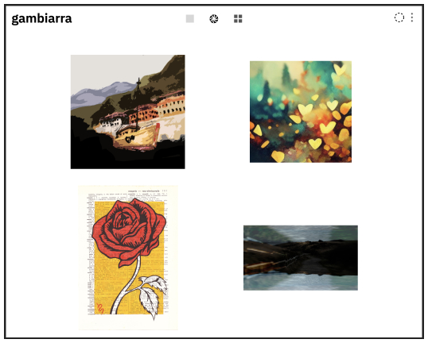

Coötoo presents: a User Interface for more cooperation and less competition.
-

You can now display any Mintbase store using the Coötoo UI.


**We offer a minimalistic interface with focus on the art.**



**Prices are not shown by default.** If the art speaks to you, you can open the single view. 

Because we recognise sometimes it’s not about buying, but enjoying.

**We don’t have the scroll of doom.** If you want to see more, you have to click.

This allows you to take time and appreciate the art that is in front of you.

Instead of sorting by latest mint or lowest price, **we display NFTs in a random order.**

Creators don’t need to be constantly minting or listing to compete for display space.

Who sold more, who minted more often - these metrics often become vicious circles while discovery and enjoyment suffers.

That’s why we made conscious choices to shift the focus away from competition. 

.

We hope you enjoy this way of viewing NFTs.

*Let’s nourish our innate need for cooperation.*


.


**DEMO VIDEO:**

**LIVE DEMO:**

----

__DEPLOY:__

* One-click deploy to [Vercel](https://www.vercel.com): 
[](https://vercel.com/new/clone?repository-url=https%3A%2F%2Fgithub.com%2Fmyklemykle%2Fstateless-web&env=NETWORKID,MINTBASECONTRACTID&envDescription=NETWORKID%20should%20be%20%22mainnet%22%20or%20%22testnet%22.%20%20See%20.env.example%20for%20more%20details%20on%20required%20%26%20optional%20environment%20variables.&envLink=https%3A%2F%2Fgithub.com%2Fmyklemykle%2Fstateless-web%2Fblob%2Fmaster%2F.env.example)


__DEV SETUP:__

1) [Install](https://docs.npmjs.com/downloading-and-installing-node-js-and-npm) node & npm.

2) Install all required node modules with npm.

```
npm install
```

3) Install [npx](https://www.npmjs.com/package/npx) globally.

```
npm install -g npx
```

__CONFIGURE:__

* Copy `.env.example` to `.env`, and configure the environment variables within.
    * You must set at least `NETWORKID` and `MINTBASECONTRACTID`.
    * You must rebuild the site to see changes take effect.

* If environment variables are not an option, edit index.html to change the hardcoded values within window.stateless_config.

__BUILD:__

This project is packaged/built/tested with [Parcel](https://parceljs.org/).
To build & host the site in development mode:

```
npx parcel src/index.html
```

To generate an optimized site for manual deployment:
```
npx parcel build src/index.html --no-scope-hoist --public-url ./
```

